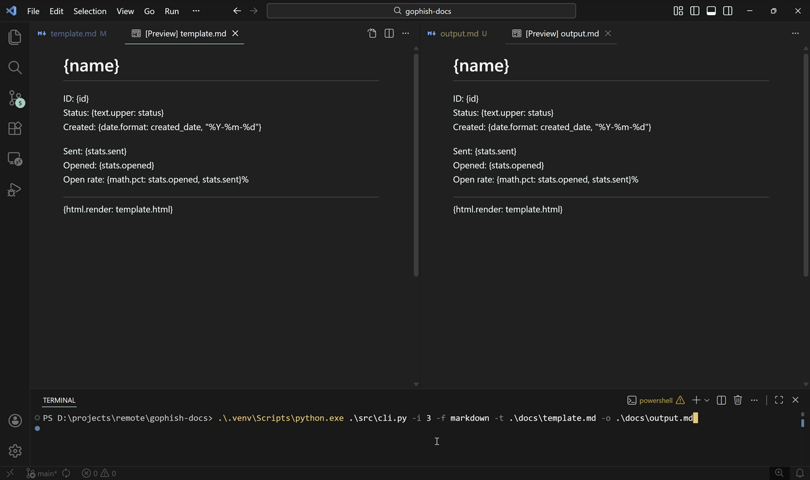

# gophish-docs

This project aims to be a text processor that treats the templates themselves as a working environment. To achieve this, the concepts of _functions_ and _variables_ have been introduced using an easy-to-follow syntax. The system currently offers **38 variables** and **9 functions**, enabling flexible data manipulation. The goal here is to minimize the technical requirements needed for red teams to produce those _satisfying_ single-click reports during their engagements.

All structures have been designed with expandability in mind. Feel free to introduce new functions and variables through _modules_, and/or add support for common export formats such as `docx` or `xlsx`.

> [!NOTE]
> A complete reference of available _functions_ and _variables_ is provided in `docs/template.md`.

